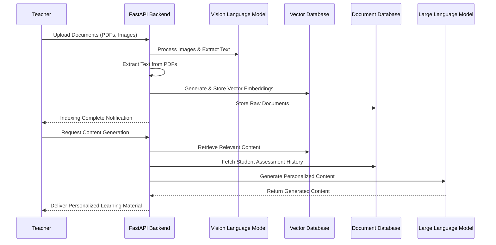

# Design Document - Content Generation Feature

## Overview

The Content Generation feature enables teachers to upload educational materials (PDFs, images) which are processed, vector indexed, and stored for later use in generating personalized learning materials. The system processes these materials, extracts text content (including from images using vision language models), creates vector embeddings, and stores them in appropriate databases. Teachers can then request personalized learning content by specifying grade level, subject, and student profile, with the system generating tailored educational materials based on the uploaded content and student assessment history.

## Architecture

### Content Generation Flow



### System Components

1. **Document Processing Service**: Handles the upload, validation, and processing of educational materials.
2. **Vector Indexing Service**: Generates vector embeddings for processed documents and manages the vector database.
3. **Content Generation Service**: Creates personalized learning materials based on indexed content and student profiles.
4. **Storage Service**: Manages the storage of raw documents and vector embeddings.
5. **Student Assessment Service**: Processes and stores student assessment data for personalization.

## Components and Interfaces

### Document Processing Service

```python
class DocumentProcessingService:
    async def process_document(self, file: UploadFile, teacher_id: str, metadata: DocumentMetadata) -> ProcessingResult:
        """Process an uploaded document (PDF or image)."""
        
    async def extract_text_from_pdf(self, pdf_file: bytes) -> str:
        """Extract text content from a PDF file."""
        
    async def extract_text_from_image(self, image_file: bytes) -> str:
        """Extract text content from an image using Vision Language Model."""
        
    async def process_student_assessment(self, image_file: bytes) -> AssessmentData:
        """Process student assessment image and extract structured data."""
```

### Vector Indexing Service

```python
class VectorIndexingService:
    async def create_embeddings(self, text: str, metadata: DocumentMetadata) -> list[float]:
        """Generate vector embeddings for the provided text."""
        
    async def store_embeddings(self, embeddings: list[float], document_id: str, metadata: DocumentMetadata) -> str:
        """Store vector embeddings in the vector database."""
        
    async def search_similar_content(self, query: str, filters: dict, limit: int = 5) -> list[SearchResult]:
        """Search for similar content based on vector similarity."""
```

### Content Generation Service

```python
class ContentGenerationService:
    async def generate_content(self, request: ContentGenerationRequest) -> GeneratedContent:
        """Generate personalized learning content."""
        
    async def retrieve_relevant_context(self, subject: str, grade_level: int, student_id: str) -> list[str]:
        """Retrieve relevant context for content generation."""
        
    async def get_student_assessment_history(self, student_id: str) -> list[AssessmentResult]:
        """Get a student's assessment history for personalization."""
```

### Storage Service

```python
class StorageService:
    async def store_raw_document(self, content: str, metadata: DocumentMetadata) -> str:
        """Store raw document content in the document database."""
        
    async def retrieve_document(self, document_id: str) -> StoredDocument:
        """Retrieve a document from the document database."""
        
    async def store_generated_content(self, content: GeneratedContent) -> str:
        """Store generated content in the database."""
```

## Data Models

### Document Models

```python
class DocumentMetadata(BaseModel):
    teacher_id: str
    subject: str
    grade_level: int
    document_type: str  # "pdf", "image"
    title: str
    description: Optional[str] = None
    upload_date: datetime = Field(default_factory=datetime.utcnow)
    tags: list[str] = []

class ProcessingResult(BaseModel):
    document_id: str
    status: str  # "processing", "completed", "failed"
    text_content: Optional[str] = None
    error_message: Optional[str] = None
    vector_id: Optional[str] = None
```

### Vector Database Models

```python
class VectorEmbedding(BaseModel):
    id: str
    document_id: str
    embedding: list[float]
    metadata: DocumentMetadata

class SearchResult(BaseModel):
    document_id: str
    score: float
    content_snippet: str
    metadata: DocumentMetadata
```

### Content Generation Models

```python
class ContentGenerationRequest(BaseModel):
    teacher_id: str
    grade_level: int
    subject: str
    student_id: str
    content_type: str  # "lesson", "worksheet", "quiz", etc.
    specific_topic: Optional[str] = None
    difficulty_level: Optional[str] = None

class GeneratedContent(BaseModel):
    id: str
    title: str
    content: str
    grade_level: int
    subject: str
    student_id: str
    teacher_id: str
    content_type: str
    created_at: datetime = Field(default_factory=datetime.utcnow)
    sources: list[str] = []  # IDs of documents used as sources
```

### Student Assessment Models

```python
class AssessmentData(BaseModel):
    student_id: str
    subject: str
    assessment_date: datetime
    score: float
    strengths: list[str]
    weaknesses: list[str]
    recommendations: list[str]

class StudentProfile(BaseModel):
    id: str
    name: str
    grade_level: int
    teacher_id: str
    subjects: list[str]
    assessment_history: list[AssessmentData] = []
```

## Database Schema

### Firestore Collections

1. **documents**: Stores raw document content and metadata
   - Fields: document_id, teacher_id, content, metadata, status, created_at

2. **vector_embeddings**: Stores vector embeddings (or references to them)
   - Fields: vector_id, document_id, metadata

3. **generated_content**: Stores generated learning materials
   - Fields: content_id, title, content, grade_level, subject, student_id, teacher_id, content_type, created_at, sources

4. **students**: Stores student profiles
   - Fields: student_id, name, grade_level, teacher_id, subjects

5. **assessments**: Stores student assessment data
   - Fields: assessment_id, student_id, subject, assessment_date, score, strengths, weaknesses, recommendations

### Vector Database

We will use a dedicated vector database (Pinecone, Weaviate, or Qdrant) to store and query vector embeddings efficiently. The vector database will store:

1. Vector embeddings of document content
2. Metadata for filtering (teacher_id, subject, grade_level)
3. References to the original documents in Firestore

## API Endpoints

### Document Upload and Processing

```
POST /v1/content/upload
- Multipart form with file and metadata
- Protected endpoint (requires authentication)
- Returns processing status and document ID

GET /v1/content/status/{document_id}
- Check processing status of a document
- Protected endpoint (requires authentication)
- Returns current status and any error messages

GET /v1/content/documents
- List all documents uploaded by the teacher
- Protected endpoint (requires authentication)
- Supports filtering by subject, grade_level, etc.
```

### Student Assessment Upload

```
POST /v1/students/assessments/upload
- Multipart form with assessment image and metadata
- Protected endpoint (requires authentication)
- Returns processing status and assessment ID

GET /v1/students/{student_id}/assessments
- Get assessment history for a student
- Protected endpoint (requires authentication)
- Supports filtering by subject, date range, etc.
```

### Content Generation

```
POST /v1/content/generate
- Request body with ContentGenerationRequest
- Protected endpoint (requires authentication)
- Returns generated content or job ID for async processing

GET /v1/content/generated/{content_id}
- Get a specific generated content
- Protected endpoint (requires authentication)

GET /v1/content/generated
- List all generated content for the teacher
- Protected endpoint (requires authentication)
- Supports filtering by subject, grade_level, student_id, etc.
```

## Error Handling

### Error Categories

1. **File Processing Errors**
   - Invalid file format
   - File too large
   - Corrupted file
   - Text extraction failure

2. **Vector Indexing Errors**
   - Embedding generation failure
   - Vector database connection issues
   - Query timeout

3. **Content Generation Errors**
   - Insufficient context
   - LLM API errors
   - Rate limiting
   - Timeout

### Error Handling Strategy

1. **Graceful Degradation**
   - Fall back to simpler processing methods if advanced ones fail
   - Provide partial results when possible

2. **Retry Mechanism**
   - Implement exponential backoff for transient errors
   - Queue failed operations for later retry

3. **User Feedback**
   - Provide clear error messages
   - Suggest alternative actions
   - Show progress indicators for long-running operations

## Testing Strategy

### Unit Testing

- Test individual components (document processing, vector indexing, content generation)
- Mock external dependencies (Firebase, vector database, LLM API)
- Test error handling and edge cases

### Integration Testing

- Test the complete flow from document upload to content generation
- Test API endpoints with realistic data
- Verify database interactions

### Performance Testing

- Test with large documents and high concurrency
- Measure response times for vector queries
- Evaluate LLM generation time

### Security Testing

- Verify authentication and authorization
- Test for common vulnerabilities (injection, XSS)
- Ensure proper data isolation between teachers

## Implementation Plan

1. Set up the document processing service
2. Implement vector indexing with a suitable vector database
3. Create the content storage and retrieval system
4. Develop the student assessment processing capability
5. Build the content generation service
6. Integrate all components and create API endpoints
7. Implement error handling and monitoring
8. Conduct testing and optimization

## Technology Choices

1. **Vector Database**: Pinecone or Weaviate for efficient similarity search
2. **Document Processing**: PyPDF2 for PDF text extraction, Google Vision API for OCR
3. **Vision Language Model**: Gemini Pro Vision for image understanding and text extraction
4. **Embedding Model**: Vertex AI Embeddings for generating vector embeddings
5. **Content Generation**: Gemini Pro for personalized content generation
6. **Storage**: Firebase Firestore for document and metadata storage, Firebase Storage for raw files