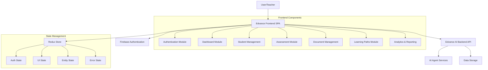

# Design Document: Edvance Frontend

## Overview

The Edvance Frontend is a modern, responsive web application that provides teachers with tools to manage students, create and analyze assessments, and leverage AI-generated personalized learning paths. The frontend will connect to the existing Edvance AI Backend, which provides a comprehensive API for educational content management, student assessment, and personalized learning.

This design document outlines the architecture, components, data models, and other technical aspects of the Edvance Frontend application.

## Architecture

### Overall Architecture

The Edvance Frontend will be built as a Single Page Application (SPA) using React, with the following key architectural components:

1. **Presentation Layer**: React components organized in a component hierarchy
2. **State Management**: Redux for global state management
3. **API Integration**: Axios for API requests to the backend
4. **Authentication**: Firebase Authentication integration
5. **Routing**: React Router for client-side routing
6. **UI Framework**: Material-UI for consistent design components

### Architecture Diagram



### Technical Stack

- **Frontend Framework**: React 18+
- **State Management**: Redux with Redux Toolkit
- **UI Framework**: Material-UI v5
- **API Client**: Axios
- **Authentication**: Firebase Authentication
- **Routing**: React Router v6
- **Form Handling**: Formik with Yup validation
- **Charts and Visualizations**: Chart.js / D3.js
- **Testing**: Jest and React Testing Library
- **Build Tool**: Vite
- **Package Manager**: npm/yarn

## Components and Interfaces

### Component Hierarchy

The application will be organized into the following component hierarchy:

```
App
├── Layout
│   ├── Navbar
│   ├── Sidebar
│   └── Footer
├── Pages
│   ├── Auth
│   │   ├── Login
│   │   ├── Register
│   │   └── ForgotPassword
│   ├── Dashboard
│   ├── Students
│   │   ├── StudentList
│   │   ├── StudentDetail
│   │   ├── StudentForm
│   │   └── StudentImport
│   ├── Assessments
│   │   ├── AssessmentList
│   │   ├── AssessmentDetail
│   │   ├── AssessmentCreator
│   │   └── AssessmentResults
│   ├── Documents
│   │   ├── DocumentList
│   │   ├── DocumentDetail
│   │   └── DocumentUpload
│   ├── LearningPaths
│   │   ├── PathList
│   │   ├── PathDetail
│   │   ├── PathCreator
│   │   └── PathMonitoring
│   └── Analytics
│       ├── ClassOverview
│       ├── StudentAnalytics
│       ├── AssessmentAnalytics
│       └── LearningPathAnalytics
└── Components
    ├── Common
    │   ├── LoadingSpinner
    │   ├── ErrorBoundary
    │   ├── Notification
    │   └── ConfirmDialog
    ├── Forms
    │   ├── FormFields
    │   └── ValidationSchemas
    ├── Tables
    │   ├── DataTable
    │   ├── Pagination
    │   └── Filters
    └── Charts
        ├── BarChart
        ├── LineChart
        ├── PieChart
        └── ProgressChart
```

### Key Interfaces

#### Authentication Module

- **Login**: Email/password login form with Firebase Authentication
- **Registration**: New user registration form
- **Profile Management**: User profile viewing and editing
- **Password Reset**: Password recovery functionality

#### Dashboard

- **Overview Cards**: Summary statistics (students, assessments, learning paths)
- **Recent Activity**: Timeline of recent actions and events
- **Quick Actions**: Buttons for common tasks
- **Notifications**: System notifications and alerts

#### Student Management

- **Student List**: Sortable, filterable table of students
- **Student Detail**: Comprehensive view of student information and performance
- **Student Form**: Add/edit student information
- **Bulk Import**: CSV upload for adding multiple students

#### Assessment Management

- **Assessment List**: Table of created assessments
- **Assessment Creator**: Interface for configuring and generating assessments
- **Assessment Detail**: View of assessment questions and answers
- **Assessment Results**: Student performance data and analytics

#### Document Management

- **Document List**: Table of uploaded documents
- **Document Upload**: File upload interface with drag-and-drop
- **Document Detail**: Document metadata and content preview

#### Learning Paths

- **Path List**: Overview of all learning paths
- **Path Detail**: Detailed view of learning path steps and progress
- **Path Creator**: Interface for generating new learning paths
- **Path Monitoring**: Controls for automated learning path generation

#### Analytics and Reporting

- **Class Overview**: High-level performance metrics
- **Student Analytics**: Detailed student performance visualizations
- **Assessment Analytics**: Assessment effectiveness and results
- **Learning Path Analytics**: Learning path progress and effectiveness
- **Report Generator**: Interface for creating downloadable reports

## Data Models

### Frontend Data Models

These models represent how data will be structured in the frontend application:

#### User Model

```typescript
interface User {
  uid: string;
  email: string;
  displayName?: string;
  photoURL?: string;
  subjects: string[];
  createdAt: Date;
  lastLogin?: Date;
}
```

#### Student Model

```typescript
interface Student {
  studentId: string;
  teacherUid: string;
  firstName: string;
  lastName: string;
  grade: number;
  defaultPassword: string;
  subjects: string[];
  createdAt: Date;
  lastLogin?: Date;
  isActive: boolean;
  currentLearningPaths: Record<string, string>; // subject -> pathId
  completedAssessments: string[];
  performanceMetrics: Record<string, any>;
}
```

#### Assessment Model

```typescript
interface AssessmentQuestion {
  questionId: string;
  questionText: string;
  options: string[];
  correctAnswer: number;
  explanation: string;
  difficulty: string;
  topic: string;
}

interface Assessment {
  assessmentId: string;
  configId: string;
  teacherUid: string;
  title: string;
  subject: string;
  grade: number;
  difficulty: string;
  topic: string;
  questions: AssessmentQuestion[];
  timeLimitMinutes: number;
  createdAt: Date;
  isActive: boolean;
}

interface AssessmentResult {
  resultId: string;
  studentId: string;
  assessmentId: string;
  answers: number[];
  score: number;
  totalQuestions: number;
  percentage: number;
  timeTakenMinutes: number;
  submittedAt: Date;
  strengths: string[];
  weaknesses: string[];
  recommendedLearningPath?: string;
}
```

#### Document Model

```typescript
interface Document {
  documentId: string;
  teacherUid: string;
  title: string;
  fileName: string;
  fileType: string;
  fileSize: number;
  uploadedAt: Date;
  processingStatus: 'pending' | 'processing' | 'completed' | 'failed';
  contentPreview?: string;
  tags: string[];
}
```

#### Learning Path Model

```typescript
enum DifficultyLevel {
  BEGINNER = "beginner",
  EASY = "easy",
  MEDIUM = "medium",
  HARD = "hard",
  ADVANCED = "advanced"
}

enum LearningObjectiveType {
  REMEMBER = "remember",
  UNDERSTAND = "understand",
  APPLY = "apply",
  ANALYZE = "analyze",
  EVALUATE = "evaluate",
  CREATE = "create"
}

interface LearningStep {
  stepId: string;
  stepNumber: number;
  title: string;
  description: string;
  subject: string;
  topic: string;
  subtopic?: string;
  difficultyLevel: DifficultyLevel;
  learningObjective: LearningObjectiveType;
  contentType: string;
  contentUrl?: string;
  contentText?: string;
  estimatedDurationMinutes: number;
  prerequisites: string[];
  addressesGaps: string[];
  isCompleted: boolean;
  completedAt?: Date;
  performanceScore?: number;
}

interface LearningPath {
  pathId: string;
  studentId: string;
  teacherUid: string;
  title: string;
  description: string;
  subject: string;
  targetGrade: number;
  learningGoals: string[];
  addressesGaps: string[];
  steps: LearningStep[];
  totalEstimatedDurationMinutes: number;
  currentStep: number;
  completionPercentage: number;
  startedAt?: Date;
  completedAt?: Date;
  generationMethod: string;
  sourceAssessments: string[];
  adaptationHistory: Record<string, any>[];
  createdAt: Date;
  lastUpdated: Date;
}
```

### Redux Store Structure

```typescript
interface RootState {
  auth: {
    user: User | null;
    loading: boolean;
    error: string | null;
  };
  students: {
    items: Student[];
    selectedStudent: Student | null;
    loading: boolean;
    error: string | null;
  };
  assessments: {
    items: Assessment[];
    selectedAssessment: Assessment | null;
    results: AssessmentResult[];
    loading: boolean;
    error: string | null;
  };
  documents: {
    items: Document[];
    selectedDocument: Document | null;
    loading: boolean;
    error: string | null;
  };
  learningPaths: {
    items: LearningPath[];
    selectedPath: LearningPath | null;
    monitoringStatus: {
      active: boolean;
      lastUpdated: Date;
    };
    loading: boolean;
    error: string | null;
  };
  ui: {
    sidebarOpen: boolean;
    notifications: Notification[];
    theme: 'light' | 'dark';
    currentView: string;
  };
}
```

## API Integration

### API Service Structure

The frontend will communicate with the backend through a set of service modules:

```typescript
// Base API service with common functionality
class ApiService {
  constructor(baseURL, authTokenProvider) {
    this.axios = axios.create({
      baseURL,
      timeout: 30000,
    });
    
    // Add auth token to requests
    this.axios.interceptors.request.use(config => {
      const token = authTokenProvider();
      if (token) {
        config.headers.Authorization = `Bearer ${token}`;
      }
      return config;
    });
    
    // Handle common errors
    this.axios.interceptors.response.use(
      response => response,
      error => this.handleError(error)
    );
  }
  
  handleError(error) {
    // Common error handling logic
    return Promise.reject(error);
  }
}

// Specific service modules
class AuthService extends ApiService {}
class StudentService extends ApiService {}
class AssessmentService extends ApiService {}
class DocumentService extends ApiService {}
class LearningPathService extends ApiService {}
class AnalyticsService extends ApiService {}
```

### Key API Endpoints

The frontend will integrate with the following backend API endpoints:

#### Authentication Endpoints
- `POST /v1/auth/signup` - User registration
- `GET /v1/auth/me` - Get current user profile
- `PUT /v1/auth/me/profile` - Update user profile
- `POST /v1/auth/logout` - User logout

#### Student Endpoints
- `GET /v1/students` - Get all students
- `GET /v1/students/{id}` - Get student by ID
- `POST /v1/students` - Create new student
- `PUT /v1/students/{id}` - Update student
- `DELETE /v1/students/{id}` - Delete student
- `POST /v1/students/batch` - Batch import students

#### Assessment Endpoints
- `GET /v1/assessments` - Get all assessments
- `GET /v1/assessments/{id}` - Get assessment by ID
- `POST /v1/assessments` - Create new assessment
- `DELETE /v1/assessments/{id}` - Delete assessment
- `POST /v1/assessments/{id}/assign` - Assign assessment to students
- `GET /v1/assessments/{id}/results` - Get assessment results

#### Document Endpoints
- `GET /v1/documents` - Get all documents
- `GET /v1/documents/{id}` - Get document by ID
- `POST /v1/documents` - Upload new document
- `DELETE /v1/documents/{id}` - Delete document
- `POST /v1/documents/batch` - Batch upload documents

#### Learning Path Endpoints
- `GET /v1/learning/student/{id}/learning-paths` - Get student learning paths
- `GET /v1/learning/learning-path/{id}` - Get learning path details
- `POST /v1/learning/generate-learning-path` - Generate new learning path
- `POST /v1/learning/learning-path/{id}/update-progress` - Update learning path progress
- `POST /v1/learning/adapt-learning-path/{id}` - Adapt learning path
- `POST /v1/learning/start-monitoring` - Start learning path monitoring
- `GET /v1/learning/monitoring-status` - Get monitoring status

#### Analytics Endpoints
- `GET /v1/learning/teacher/learning-analytics` - Get teacher analytics
- `GET /v1/learning/student/{id}/learning-insights` - Get student insights
- `GET /v1/learning/student/{id}/progress` - Get student progress

## Error Handling

### Error Handling Strategy

The application will implement a comprehensive error handling strategy:

1. **API Error Handling**:
   - HTTP error status codes (4xx, 5xx)
   - Network connectivity issues
   - Timeout handling
   - Retry logic for transient errors

2. **UI Error Handling**:
   - Form validation errors
   - User feedback for failed operations
   - Graceful degradation when features are unavailable

3. **Global Error Handling**:
   - Error boundary components to prevent UI crashes
   - Centralized error logging
   - User-friendly error messages

### Error Types

```typescript
enum ErrorType {
  NETWORK = 'network',
  AUTHENTICATION = 'authentication',
  AUTHORIZATION = 'authorization',
  VALIDATION = 'validation',
  SERVER = 'server',
  NOT_FOUND = 'not_found',
  TIMEOUT = 'timeout',
  UNKNOWN = 'unknown'
}

interface AppError {
  type: ErrorType;
  message: string;
  originalError?: any;
  context?: Record<string, any>;
}
```

## Testing Strategy

### Testing Approach

The frontend application will be tested using the following approaches:

1. **Unit Testing**:
   - Individual component testing
   - Service module testing
   - Utility function testing
   - Redux reducer and action testing

2. **Integration Testing**:
   - Component interaction testing
   - API integration testing
   - Redux store integration testing

3. **End-to-End Testing**:
   - Critical user flows
   - Authentication flows
   - Form submission flows

### Testing Tools

- **Jest**: Test runner and assertion library
- **React Testing Library**: Component testing
- **MSW (Mock Service Worker)**: API mocking
- **Cypress**: End-to-end testing

### Test Organization

```
src/
├── __tests__/
│   ├── unit/
│   │   ├── components/
│   │   ├── services/
│   │   └── utils/
│   ├── integration/
│   └── e2e/
└── components/
    └── ComponentName/
        ├── ComponentName.tsx
        ├── ComponentName.test.tsx
        └── index.ts
```

## UI/UX Design

### Design System

The application will use Material-UI as its foundation, with a custom theme that aligns with the Edvance brand identity.

#### Color Palette

- **Primary**: #3f51b5 (Indigo)
- **Secondary**: #f50057 (Pink)
- **Background**: #f5f5f5 (Light Grey)
- **Surface**: #ffffff (White)
- **Error**: #f44336 (Red)
- **Warning**: #ff9800 (Orange)
- **Info**: #2196f3 (Blue)
- **Success**: #4caf50 (Green)

#### Typography

- **Primary Font**: Roboto
- **Headings**: Roboto Medium
- **Body Text**: Roboto Regular
- **Font Sizes**:
  - H1: 2.5rem
  - H2: 2rem
  - H3: 1.75rem
  - H4: 1.5rem
  - Body: 1rem
  - Small: 0.875rem

### Responsive Design

The application will implement a responsive design approach:

- **Mobile First**: Design for mobile devices first, then enhance for larger screens
- **Breakpoints**:
  - xs: 0px
  - sm: 600px
  - md: 960px
  - lg: 1280px
  - xl: 1920px
- **Layout Adjustments**:
  - Single column layout on mobile
  - Multi-column layout on tablets and desktops
  - Collapsible sidebar on smaller screens
  - Responsive data tables with horizontal scrolling on mobile

### Accessibility

The application will follow WCAG 2.1 AA guidelines:

- Semantic HTML structure
- Proper ARIA attributes
- Keyboard navigation support
- Sufficient color contrast
- Screen reader compatibility
- Focus management
- Alternative text for images
- Form labels and error messages

## Deployment and CI/CD

### Build Process

1. **Development Build**:
   - Source code transpilation
   - Development server with hot reloading
   - Environment variable injection

2. **Production Build**:
   - Code minification and optimization
   - Tree shaking
   - Asset optimization
   - Environment variable injection

### Deployment Strategy

The application will be deployed using the following approach:

1. **Environments**:
   - Development
   - Staging
   - Production

2. **Hosting**:
   - Firebase Hosting for static assets
   - Cloud CDN for content delivery

3. **CI/CD Pipeline**:
   - GitHub Actions for automated builds and deployments
   - Automated testing before deployment
   - Environment-specific configuration

### Environment Configuration

The application will use environment variables for configuration:

```
# Development
VITE_API_BASE_URL=http://localhost:8000
VITE_FIREBASE_CONFIG={...}
VITE_ENVIRONMENT=development

# Production
VITE_API_BASE_URL=https://api.edvance.com
VITE_FIREBASE_CONFIG={...}
VITE_ENVIRONMENT=production
```

## Security Considerations

### Authentication and Authorization

- Firebase Authentication for user authentication
- JWT token-based API authorization
- Role-based access control
- Session timeout and automatic logout

### Data Protection

- HTTPS for all API communication
- Sensitive data encryption
- Input validation and sanitization
- Protection against common web vulnerabilities (XSS, CSRF)

### Compliance

- GDPR compliance for user data
- FERPA compliance for student data
- Data retention policies
- Privacy policy implementation

## Performance Optimization

### Frontend Performance

- Code splitting and lazy loading
- Asset optimization (images, fonts)
- Caching strategies
- Virtual scrolling for large data sets
- Memoization for expensive computations
- Debouncing for frequent user interactions

### API Performance

- Request batching
- Data pagination
- Response caching
- Optimistic UI updates
- Background data fetching

## Conclusion

This design document outlines the architecture, components, data models, and technical considerations for the Edvance Frontend application. The design focuses on creating a modern, responsive, and accessible user interface that integrates seamlessly with the existing Edvance AI Backend to provide teachers with powerful tools for educational content management and personalized learning.